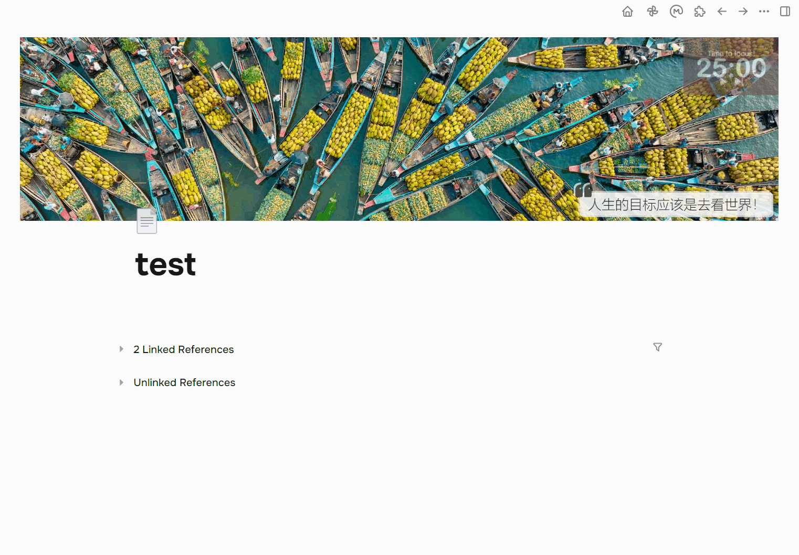
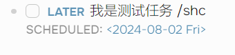

# Logseq Task Done Time Mini Plugin✔️

[中文](./README.md)|English

> Silently adds completion information (date, time, and more...) to your DONE state.

## Note

This plugin is temporarily incompatible with timetracking; please disable the timetracking function in the settings (Settings-Editor-Enable timetracking, and turn it off).

## Background

I always felt that the DONE state of tasks in Logseq was not perfect; it should automatically add completion time or similar information.

Later, I saw some plugins in the community, such as [logseq-plugin-confirmation-done-task](https://github.com/YU000jp/logseq-plugin-confirmation-done-task) and [logseq-done-time](https://github.com/mjs/logseq-done-time), but I felt that they did not meet my requirements in terms of operation.

My requirement was to silently add marking information with a certain level of customization. I use Logseq intensively every day and my demands for many details have been increasing, so I came up with the idea of writing my own plugin.

So I spent two days creating a simple prototype ([about that day](https://mlhiter.github.io/#/page/logseq-task-done-time-mini)).

(I didn't expect that developing a Logseq plugin would be quite easy, even a bit simple 😀)

Thus, Task Done Time Mini was born. The name is quite casual; "mini" means I hope it can be as compact as possible to reduce our context switching in task management.

## Features

> Note: DONE information refers to the information we insert.

1. **Immediately add DONE information** when the task state changes to DONE (regardless of whether you switch it using ctrl+enter, click the button, or type DONE to change the state) 🔨
2. **Immediately remove DONE information** when the task state changes from DONE to another state 🛠
3. The input string has a certain level of **customization**; you can set your own template for configuration 📦
4. Supports certain **variables**; you can insert the current date and time using `{date}` and `{time}` (if you have more variable needs, please raise issues, and I will address them as soon as possible) 📝
5. You can choose the **display position**; currently, three modes are supported 🚧:
   1. Content mode: directly adds DONE information to the front or back of the current block content.
   2. Property mode: adds DONE information to the properties of the current block; the format must be correct: `propertyName:: propertyValue`.
   3. Child block mode: adds a child block to the current block and places DONE information in this child block.
6. In child block mode, I also provide a configuration option that allows you to choose whether to **default fold this child block** 🔌
7. For more details, I provide a configuration option to decide whether to add DONE information if tasks in the current day's log are completed on that day (I personally do not like adding it here) 📂
8. Enjoy! 🎉

## Feature Demonstration

1. Content Mode
   
2. Property Mode
   
3. Child Block Mode
   

## About Configuration Options

It's quite simple, so refer to the images for guidance.

## Future Plans

I hope that DONE information can be displayed in a way similar to how schedule and deadline are shown, with beautiful styles and the ability to enter a calendar component for time switching.

I have not extensively tested the project, so I will continue to use it over the next period and continuously improve the user experience.

## Some Things You Might Need to Know

1. The Date format may have some incorrect mappings since I haven’t tested it. If there are errors, please let me know in the Issues.

2. When a block changes, I directly update the block. If this causes performance issues, please inform me.
