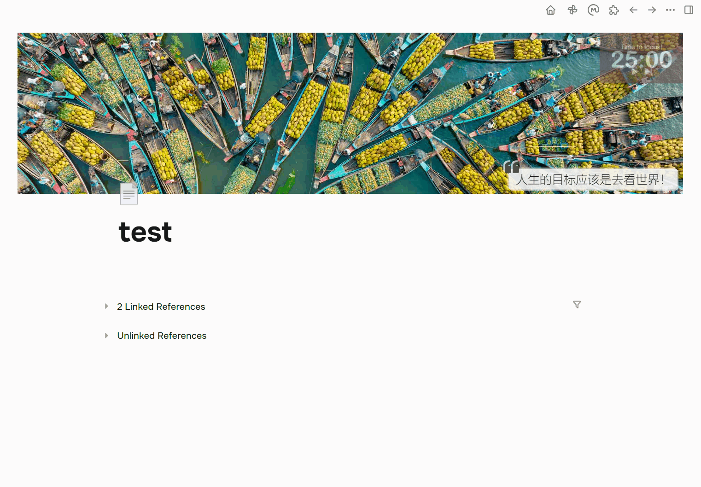
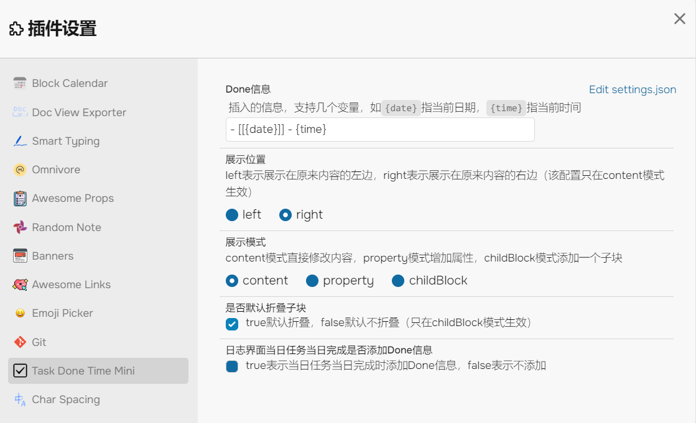
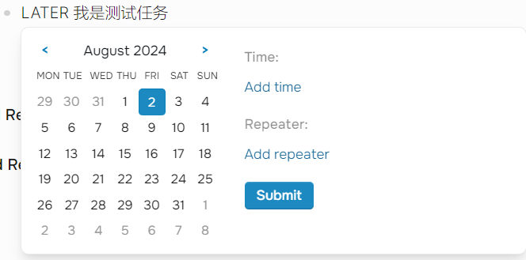
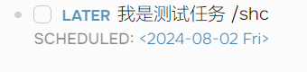

# Logseq Task Done Time Mini Plugin✔️

中文 | [English](./README.en.md)

> 给你的 DONE 状态静默添加完成信息（日期、时间甚至更多.....）

## 注意

这个插件与 timetracking 暂时不兼容，请在设置里关闭 timetracking 功能（设置-编辑器-开启 timetracking，将它关闭）

## 背景

之前我一直觉得 logseq 的任务的 DONE 状态不太完美，应该有个完成时间之类的自动添加上去。

后来在社区也看到了一些插件，比如[logseq-plugin-confirmation-done-task](https://github.com/YU000jp/logseq-plugin-confirmation-done-task)和[logseq-done-time](https://github.com/mjs/logseq-done-time)，但是感觉操作上来说并没有达到我的要求。

我的要求是能够完全静默添加标记信息，而且带有一定的自定义性。
我自己每天高强度使用 logseq，对很多细节要求也越来越高，所以萌生了自己写一个插件的想法。

于是我花了两天时间写了一个简单的原型（[关于那天](https://mlhiter.github.io/#/page/logseq-task-done-time-mini)）

（没想到 logseq 插件开发完全不难，甚至有点简单 😀）

所以，就有了它，Task Done Time Mini。命名很随心，mini 的意思是我希望它尽可能迷你，减少我们任务管理的上下文切换。

## 功能特点

> 注意：DONE 信息就是指我们插入的信息

1. 任务状态改变到 DONE 之后**立即添加 DONE 信息**（无论你是通过 ctrl+enter 切换/点击按钮更改任务状态/文字输入 DONE 改变状态）🔨
2. 当任务状态从 DONE 变为其他状态时，**立即删除 DONE 信息** 🛠
3. 输入的字符串具备一定的**自定义性**，你可以自己设置模板来配置 📦
4. 支持一定的**变量**，可以通过`{date}`和`{time}`来插入当前日期和时间（如果有更多的百变量需求，请提 issues，我会尽快解决） 📝
5. 你可以自己选择**展示位置**，现在支持三种模式 🚧：
   1. 内容模式（content）：直接将 DONE 信息添加到当前块内容的前面或者后面
   2. 属性模式（property）：将 DONE 信息添加到当前块的属性，格式必须正确`propertyName:: propertyValue`
   3. 子块模式（childBlock）：给当前块添加一个子块，并将 DONE 信息添加到这个子块里
6. 在子块模式里，我还提供了一个配置项，让你可以选择**是否默认折叠这个子块** 🔌
7. 更细节的：我提供了一个配置项，放置在当前天日志的任务如果当日完成，可以选择是否添加 DONE 信息（我是不喜欢这里添加的） 📂
8. Enjoy! 🎉

## 功能演示

1. 内容模式
   
2. 属性模式
   
3. 子块模式
   

## 关于配置项

很简单，所以参考图片即可

## 之后的计划

我可能希望 DONE 信息显示就像 schedule 和 deadline 显示的那样，样式优美而且可以进入一个日历组件进行时间的切换。

我对项目并没有非常完美地测试，所以在接下来的一段时间我会持续使用，并不断改进用户体验。

## 一些你可能需要知道的事情

1. 日期 Date 格式可能有一些错误映射，因为我没有测试它。如果有错误，请在 Issues 中告诉我。

2. 当块发生变化时我直接更新块，如果这造成了一些性能问题，请告诉我。
